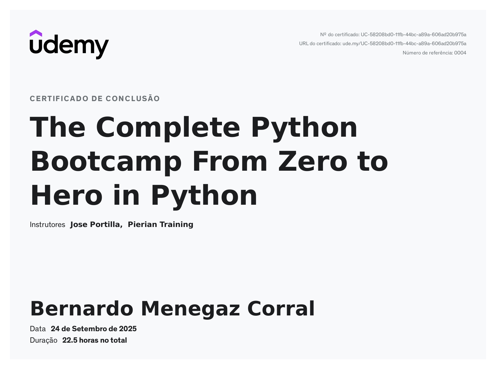

# Python Bootcamp

Repositório com os notebooks que desenvolvi durante o curso **Complete Python 3 Bootcamp (Udemy)**.  
O objetivo é documentar meu aprendizado em Python, incluindo exercícios, práticas e projetos finais.

## Estrutura dos Notebooks
- `functions_and_oop.ipynb` → exercícios de **funções** e estudo de **Programação Orientada a Objetos (OOP)**
- `warmup_project_1.ipynb` → **warmups e práticas gerais** realizadas antes do Milestone Project 1
- `milestone_project_1.ipynb` → **primeiro projeto completo** do curso (versão final organizada)
- `warmup_project_2.ipynb` → **exercícios de preparação** para o Milestone Project 2
- `milestone_project_2.ipynb` → **segundo projeto completo** do curso (versão final organizada)

## Conteúdo Estudado
- Fundamentos de Python: variáveis, estruturas de controle, coleções
- Funções: parâmetros, `*args` / `**kwargs`, funções anônimas (lambda)
- Estruturas de dados: listas, dicionários, sets e tuplas
- Programação Orientada a Objetos: classes, herança e composição
- Manipulação de arquivos e módulos
- Projetos aplicados: integração de conceitos em exercícios maiores

## Certificado

